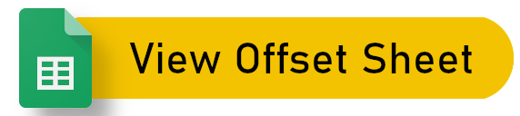

Used to help read SCS telemetry information from Eurotruck Simulator 2.

You will need to add RenCloud's telemetry plugin to your game first. The download can be found [here](https://github.com/RenCloud/scs-sdk-plugin/tree/master).

## How to use

Before you start your program, make sure Eurotruck Simulator 2 is open with the aforementioned plugin installed. This ensures the memory pool with telemetry data is created in RAM, allowing us to hook into it and stream information from it.

To utilise this package, import the **Telemetry Manager** from **ets2_telemetry** and instantiate it.

```python
from ets2_telemetry import TelemetryReader

telemetry_reader = TelemetryReader()
```

After, you can import the classes which represent the data you want to retrieve.

```python
from ets2_telemetry.general_info import GeneralInfo

general_info = GeneralInfo()
```

You can then hook the instance into `telemetry_reader` to grab the information.

```python
# Save the information into general_info
telemetry_reader.update_telemetry(general_info)

# Now general_info will have the latest information
general_info.sdk_active # True
```

## API guide

If the predefined data classes do not satisfy your needs, you can create additional ones based off the abstract class `AbstractDataClass` and parse the information in the `update` function.

The `update` function is passed the `memory_map` (The array of bytes) by **telemetry_reader**. You can extract the value using the [struct](https://docs.python.org/3/library/struct.html) package.

The following code snippet is an example of how to set up a new data class

```python
import struct
from ets2_telemetry import AbstractDataClass

class PlannedDistance(AbstractDataClass):
    """Used to get the planned distance"""
    planned_distance = 0

    def update(self, memory_map):
        self.planned_distance = struct.unpack(
            "I",
            memory_map[100:104]
        )[0]
```

Since you need to know the offset to retrieve the correct information, I have noted the information available and the corresponding offsets in the following document.

<a href="https://docs.google.com/spreadsheets/d/1n1Y35kQZ4LMr8fJDCAGoiFhGuPvXgJUMlvYnnp-zS2o/edit#gid=0" title="Link to offset sheet">
    
</a>

These offsets and information all come from [RenCloud's repository](https://github.com/RenCloud/scs-sdk-plugin/blob/master/scs-telemetry/inc/scs-telemetry-common.hpp#L26)
